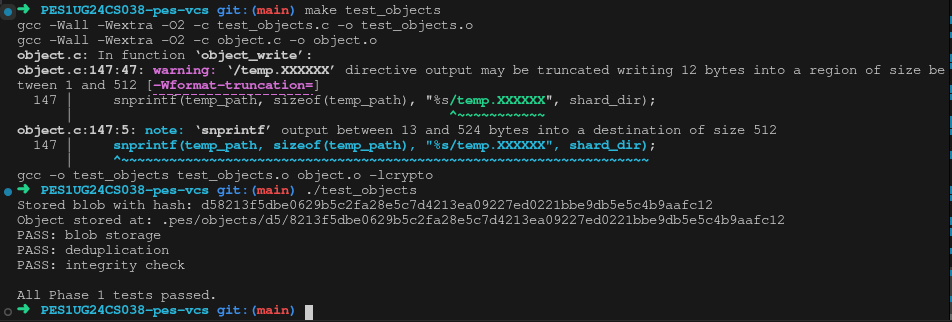
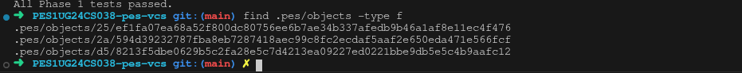
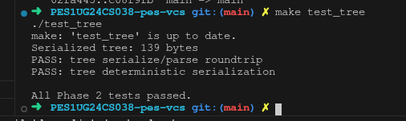
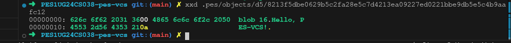
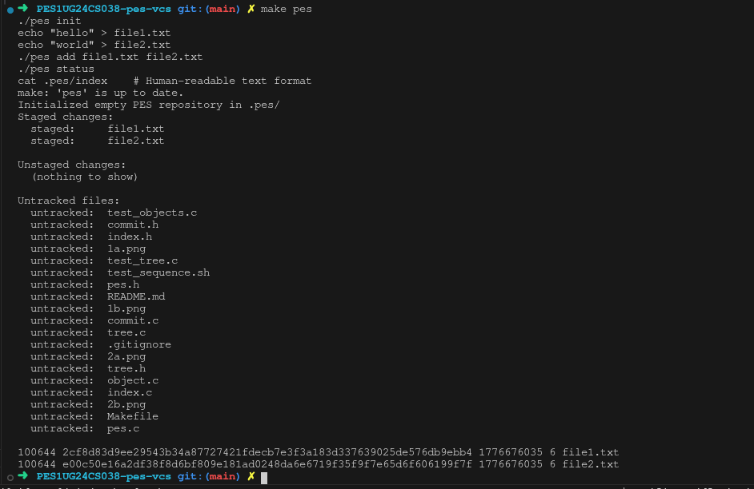
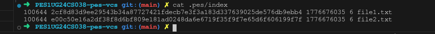
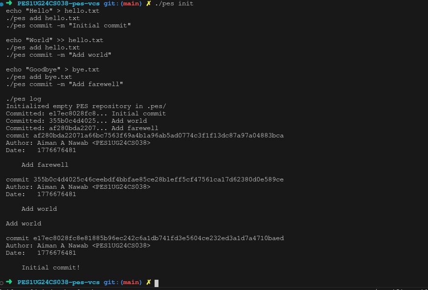
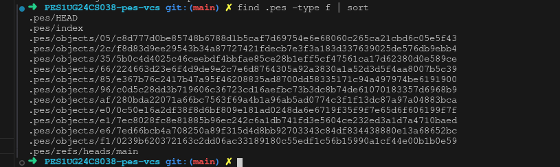
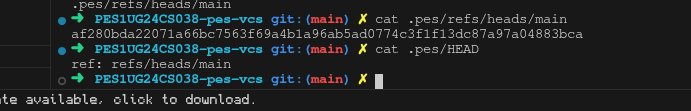

# PES-VCS Lab Report

---

## Screenshots

### Phase 1: Object Storage

**Screenshot 1A** — `./test_objects` output showing all tests passing:

**Screenshot 1B** — `find .pes/objects -type f` showing sharded directory structure:

### Phase 2: Tree Objects

**Screenshot 2A** — `./test_tree` output showing all tests passing:

**Screenshot 2B** — `xxd` of a raw tree object (first 20 lines):

### Phase 3: Staging Area

**Screenshot 3A** — `pes init` → `pes add` → `pes status` sequence:

**Screenshot 3B** — `cat .pes/index` showing the text-format index:

### Phase 4: Commits and History

**Screenshot 4A** — `pes log` output with three commits:

**Screenshot 4B** — `find .pes -type f | sort` showing object store growth:

**Screenshot 4C** — `cat .pes/refs/heads/main` and `cat .pes/HEAD` showing the reference chain:

---

## Phase 5 & 6: Analysis Questions

### Branching and Checkout

**Q5.1:** _TBD_

**Q5.2:** _TBD_

**Q5.3:** _TBD_

### Garbage Collection and Space Reclamation

**Q6.1:** _TBD_

**Q6.2:** _TBD_
